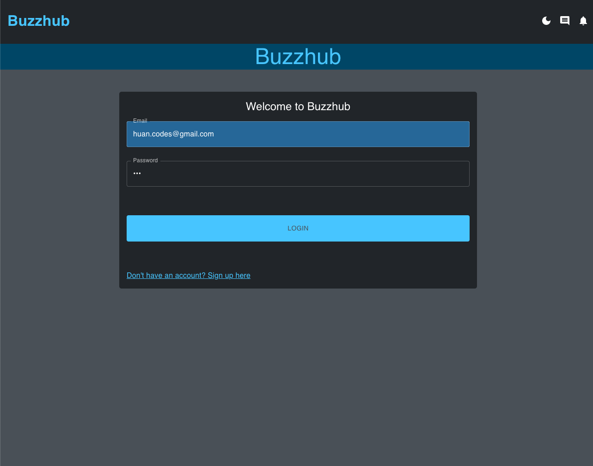
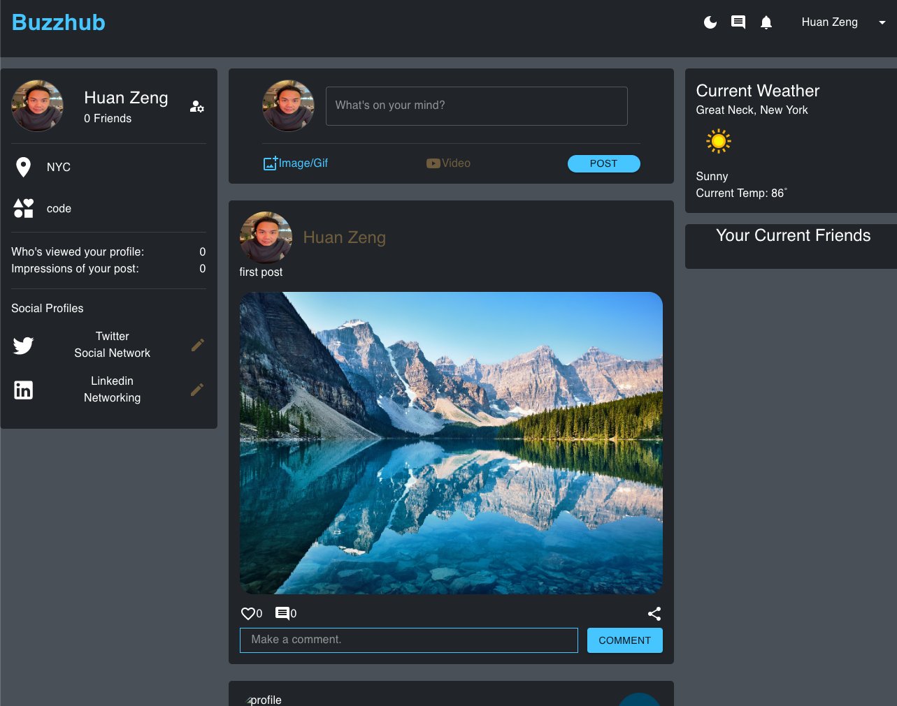
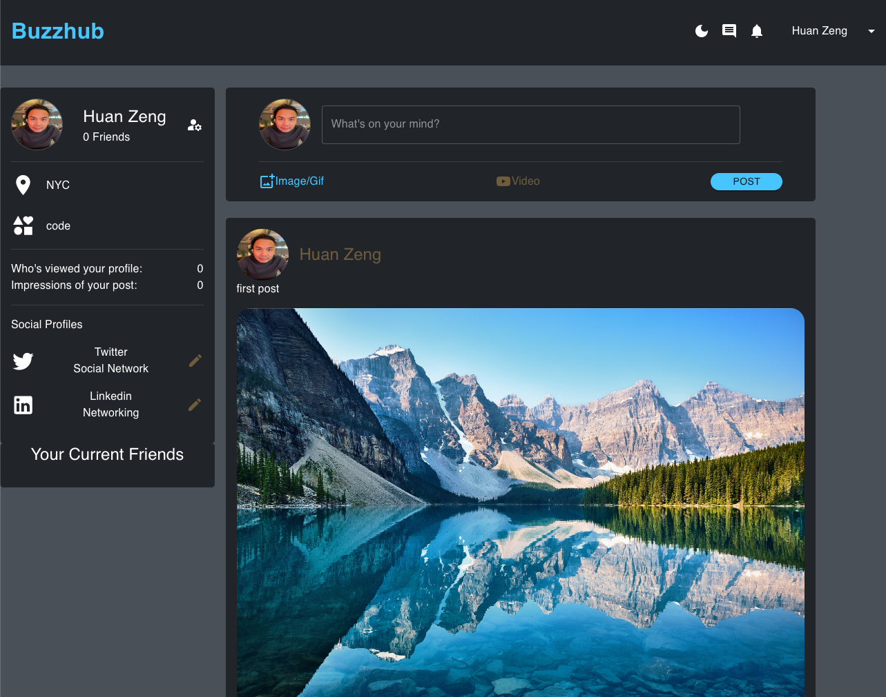

## Buzzhub

### Date: 02/23/2023

#### By: Huan Zeng

---

### [Links to deploy site with Netlify]('https://buzzhub.netlify.app/home')

---

### Desciption

A website where users can create an account to post pictures and videos to share with others. Other users can like and comments on other's post.

#### login page

#### main page

#### profile page

### Features:

- User Auth
- create post with image, gif and video
- like post
- comment on post
- add/remove friendlist
- current weather display base on location

### Technology list:

#### Front end:

- React
- Redux
- MUI
- DropZone
- Formik
- Weather API

#### Backend Server:

- Django
- Rest_framework
- PostgresSQl

#### Coming soon features:

- Edit networking tabs
